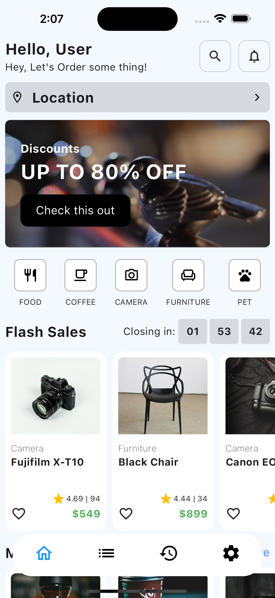
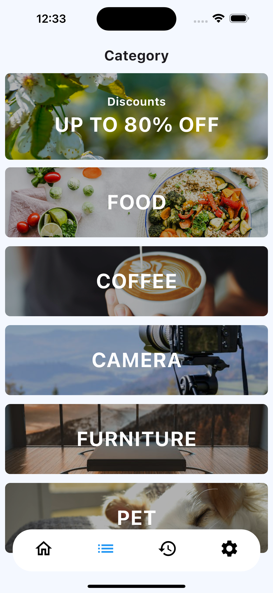

# ui_example

This project create for sample of UI e-commerce

## Table of Contents

- [Installation](#installation)
- [Running the Project](#running-the-project)
- [Project Structure](#project-structure)
- [Image Screen](#Image-Screen)

## Installation

To set up the project locally, follow these steps:

1. clone project

```bash
   git clone https://github.com/Patsanaphon-ap/ui_example.git
   cd ui_example
```

2.Install Flutter and Dart: Make sure you have Flutter and Dart installed on your machine.
3.install dependencies

```bash
flutter pub get
```

## Running the project

```bash
flutter run
```

## Project Structure

```
ui_example/
│── ios/                           # IOS file for flutter
│── android/                       # Android file for flutter
│── lib/
│   ├── main.dart                  # Entry point of the Flutter application
│   ├── mock/                      # Mock data or api
│   └── src/
│         ├── config/              # config data (RoutePath or RoutePage)
│         ├── controller/          # State management(`controller` or `binding`)
│         ├── data/                # API call (`dio` and `model`)
│         ├── ui/                  # All the screen widgets
│         ├── util/                # Utility function
│         ├── app.dart             # Flutter application material
│         ├── environment.dart     # file environment for `flavor`
│         └── injector.dart        # API injector
│── assets/                        # Images, fonts, and other assets
│── pubspec.yaml                   # Project dependencies and configuration
└── README.md                      # Project documentation
```

## Image Screen

<div class="row">
   
   
</div>
